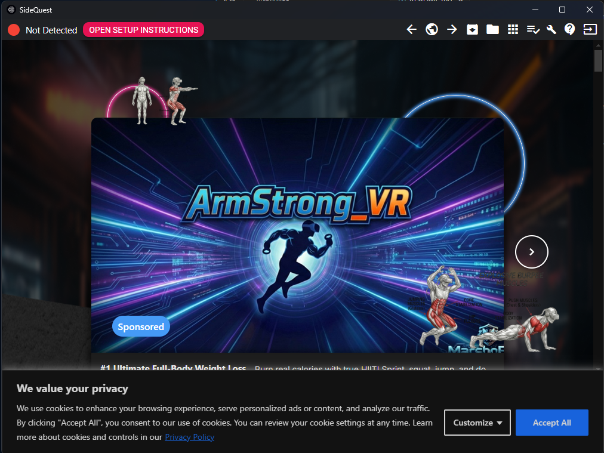
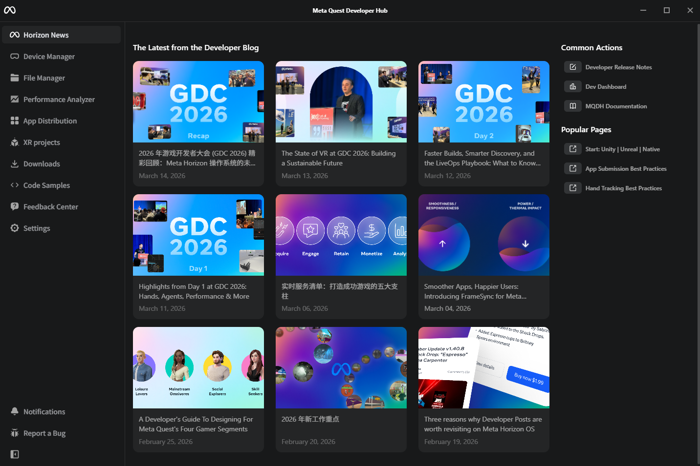

# [UnityStudy](https://github.com/MenG2744L/UnityStudy)

## Unity VRR Rigs
- Head(Camera)
- Left/Right Controller

## Build and Run
Bulid APK `File -> Bulid Profiles -> Android -> bulid`

## Install APK into Meta Quest 3s
1. ***SideQuest*** direct install or upload
2. ***Meta Quest Developer HUB***

## Avatar in Unity
### For VR low poly
- Mixamo(PC)
- READY PLAYER ME(closed) -> PLAYER ZERO
- Unity AssetStore UMA 2

### IK
- unity IK
- Final IK
- meta all in one

